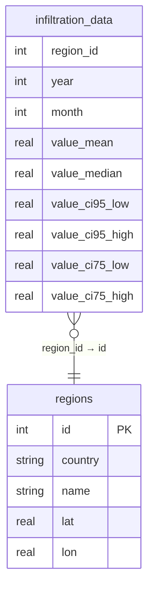

# feat: Web 端真数据查询

> **日期**: 2026-06-26
> **类型**: enhancement
> **优先级**: 🔴 最高 — Web 端当前使用占位数据，核心功能缺失

---

## 问题描述

Web 端 `database_helper_stub.dart` 对所有查询返回 `null`，用户看到的是占位假数据。根因：SQLite（sqflite）不支持浏览器环境。

**数据库规模**：`assets/infiltration.db` = **164 MB**，包含 3,614 地区 × 35 年 × 12 月 = ~1.5M 行。

---

## 方案对比

| 方案 | 首屏加载 | 服务器成本 | 复杂度 | 结论 |
|------|:--:|:--:|:--:|:--:|
| **A) Dart Shelf 后端 API** | 轻量 HTTP | 免费 tier 可用 | 中 | ✅ **推荐** |
| B) WASM SQLite + OPFS | 164MB 下载 | 零 | 高 | ❌ 首屏不可接受 |
| C) Supabase 云数据库 | 轻量 HTTP | 免费 500MB | 高 | ⚠️ 迁移成本大 |
| D) 静态 JSON 分片 | CDN | 零 | 中 | ❌ 不支持聚合查询 |

**结论：方案 A — Dart Shelf 后端**，语言一致、复用现有 SQL、部署简单。

---

## 架构设计

```
┌─────────────┐     HTTP/JSON      ┌──────────────────┐
│  Web 浏览器  │ ◄────────────────► │  Dart Shelf API  │
│  (Flutter)  │                    │  (Render.com)    │
│             │                    │  ┌────────────┐  │
│  db_helper  │                    │  │ infiltration│  │
│  _web.dart  │                    │  │   .db (164M)│  │
│  → HTTP GET │                    │  └────────────┘  │
└─────────────┘                    └──────────────────┘
```

### API 端点设计

```
GET /api/query?region_id=3614&year=2024&month=6
→ { "mean": 0.0123, "median": 0.0110, "ci95_low": ..., "ci95_high": ..., "ci75_low": ..., "ci75_high": ... }

GET /api/heatmap?year=2024&month=12
→ [{ "region_id": 1, "value_mean": 0.015 }, ...]

GET /api/insight/rank?year=2024&month=6&value=0.0123
→ { "rank": 1234, "total": 3614 }

GET /api/insight/trend?region_id=42&month=6
→ { "slope": 0.0002, "first": 0.010, "last": 0.016, "years": [{ "year": 1990, "value": 0.010 }, ...] }

GET /api/insight/monthly?region_id=42&year=2024
→ { "high_month": 1, "high_val": 0.020, "low_month": 7, "low_val": 0.005, "months": [...] }

GET /api/compare?region_a=42&region_b=100&year=2024&month=6
→ { "a": {...}, "b": {...} }
```

---

## 实施步骤

### Phase 1: 后端 API 服务器

- [ ] **1.1** 创建 `backend/` 目录，初始化 Dart 项目
  - `backend/pubspec.yaml` — 依赖 `shelf`, `shelf_router`, `shelf_cors_headers`, `sqlite3`
  - `backend/bin/server.dart` — 入口，监听 `$PORT`（Render 环境变量）
- [ ] **1.2** 实现 SQLite 数据访问层
  - 复用 `infiltration.db`，直接挂载（不用 asset bundle）
  - 文件：`backend/lib/database.dart`
- [ ] **1.3** 实现 REST API 路由
  - 文件：`backend/lib/routes.dart`
  - 复用现有 SQL 查询逻辑（从 insight_service / heatmap_service 移植）
- [ ] **1.4** 添加 CORS + 错误处理 + 健康检查
  - `GET /health` → `{"status": "ok"}`
- [ ] **1.5** 创建 `Dockerfile`（Render.com 部署用）
- [ ] **1.6** 本地测试：`dart run bin/server.dart` + curl 验证所有端点

### Phase 2: Web 前端适配

- [ ] **2.1** 创建 `database_helper_web.dart`
  - `DatabaseHelper` 单例，HTTP 调用后端 API
  - 添加内存缓存层（LRU，~100 条记录），减少重复请求
  - `InfiltrationRecord` 与 mobile 版本保持完全相同的接口
- [ ] **2.2** 创建 `insight_service_web.dart`
  - 将本地 SQL 聚合查询替换为后端 API 调用
  - 接口与 `insight_service.dart` 一致
- [ ] **2.3** 更新 `main.dart` 条件导入
  - 将 insight_service 也纳入条件导入
  - 将 heatmap_service 也纳入条件导入（或添加 Web 版本）
- [ ] **2.4** 添加 API base URL 配置
  - 开发环境：`http://localhost:8080`
  - 生产环境：`https://infiltration-api.onrender.com`
  - 使用 `--dart-define=API_BASE_URL=...` 注入

### Phase 3: 部署

- [ ] **3.1** Render.com 部署后端
  - 连接 GitHub 仓库
  - 配置 `Dockerfile` 或 Native Dart 运行时
  - 免费 tier：512MB RAM, 750h/月
- [ ] **3.2** 更新 GitHub Pages Web 部署
  - `flutter build web --dart-define=API_BASE_URL=https://infiltration-api.onrender.com`
- [ ] **3.3** 端到端测试：浏览器 → API → 真实数据

---

## 涉及文件

| 操作 | 文件 | 说明 |
|------|------|------|
| 新建 | `backend/` (目录) | Dart Shelf 后端 |
| 新建 | `lib/services/database_helper_web.dart` | Web HTTP 数据库 |
| 新建 | `lib/services/insight_service_web.dart` | Web 洞察服务 |
| 修改 | `lib/main.dart` | 更新条件导入 |
| 修改 | `lib/services/heatmap_service.dart` | 抽象接口 |
| 可能修改 | `lib/ui/compare_page.dart` | 适配 Web 数据源 |

---

## ERD (数据库表 — 不变)



---

## 验收标准

- [ ] Web 端打开后，选择国家→地区→年月，显示**真实**渗透系数数据（不再是占位假数据）
- [ ] 热力图在 Web 端显示真实数据（气泡颜色/大小基于实际值）
- [ ] 数据洞察在 Web 端显示真实排名/趋势/月度特征
- [ ] 对比模式在 Web 端正常工作
- [ ] API 响应时间 < 500ms（简单查询）/ < 2s（聚合查询）
- [ ] 后端健康检查返回 200

---

## 风险

| 风险 | 缓解 |
|------|------|
| Render 免费 tier 冷启动延迟 | 内存 LRU 缓存 + 客户端重试 |
| 164MB DB 超出免费 tier 磁盘 | 查询有无磁盘限制（Render 免费 1GB，够用） |
| API 跨域 CORS | `shelf_cors_headers` 配置 |
| GitHub Pages HTTPS → API HTTP | Render 默认提供 HTTPS |
